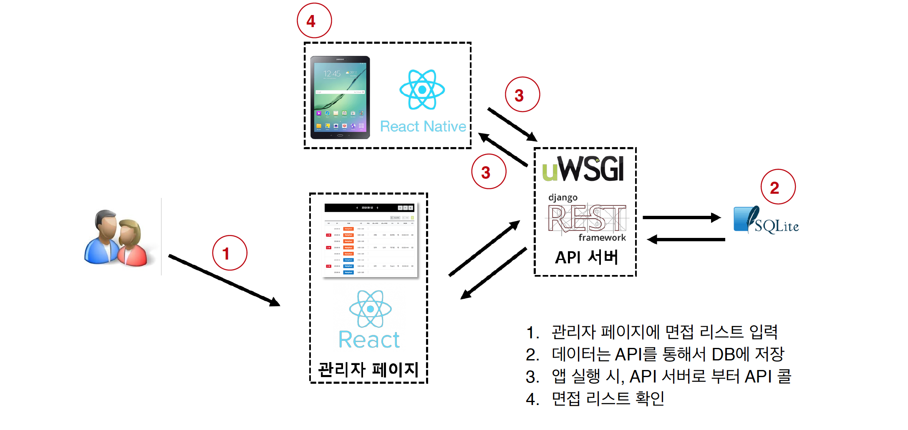
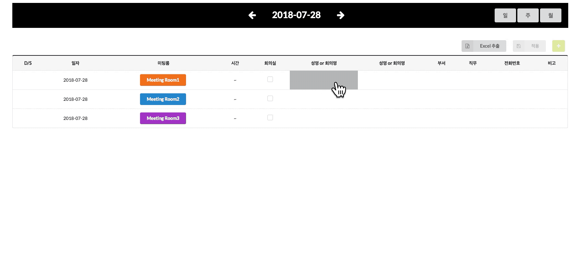
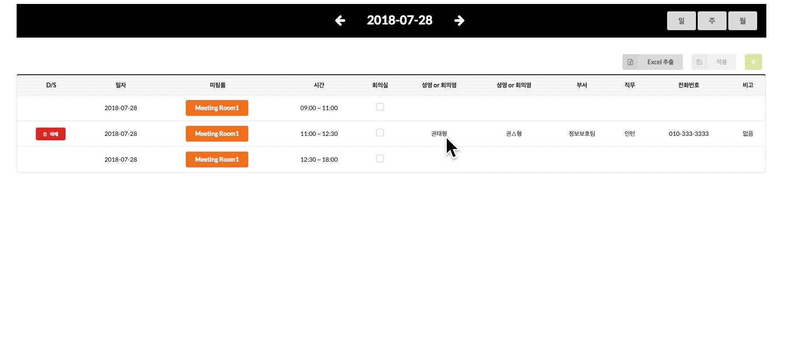
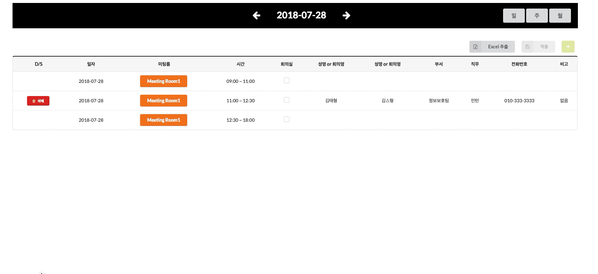
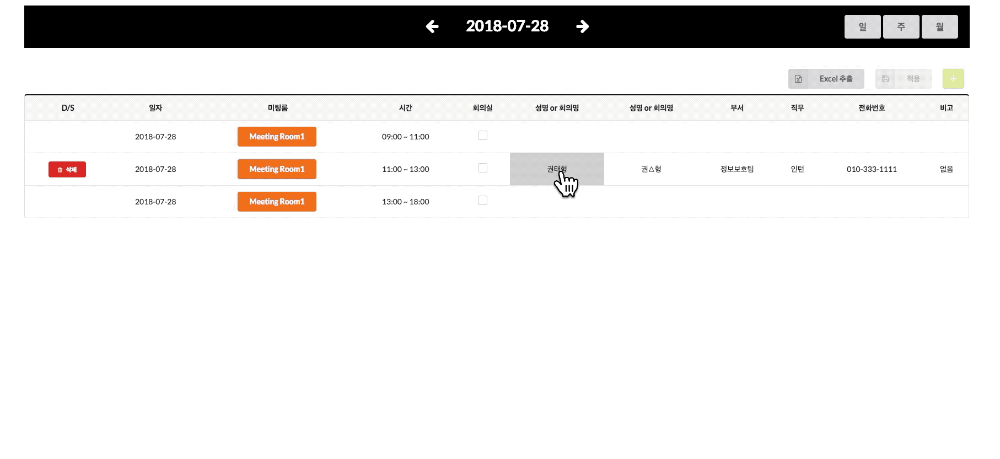
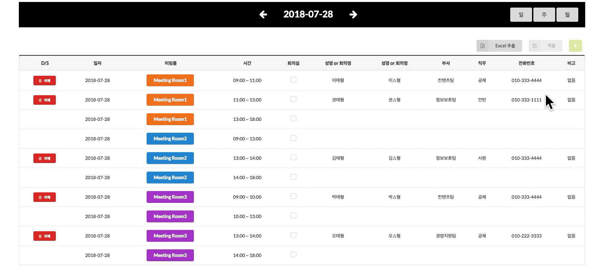
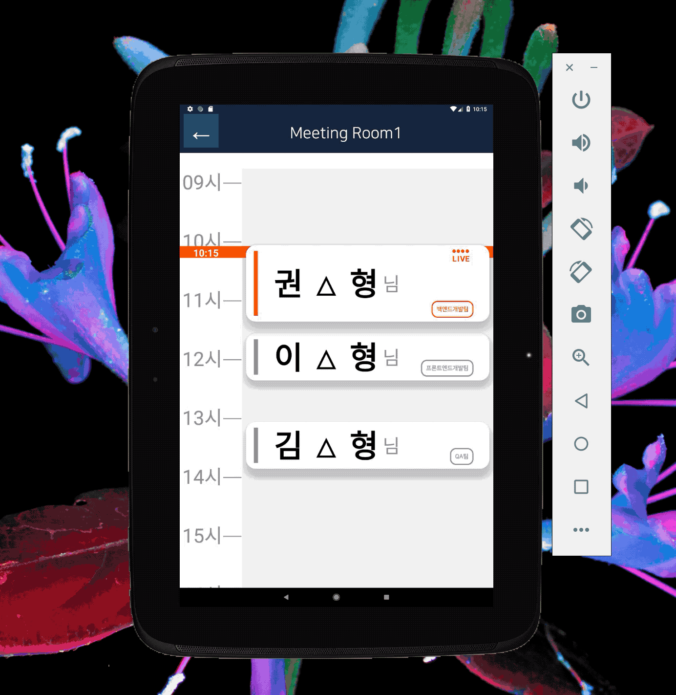

# DID(Digital Information Display) System

> 스마일게이트 면접실 DID(Digital Information Display)시스템

## Summary

* 각 면접실 입구에 놓여진 태블릿을 통해, 면접 자는 **본인의 면접 시간과 면접 자 리스트를 확인**할 수 있다.

* 관리자는 관리자 페이지에서, **면접시간 조정 및 면접 자 관리**를 할 수 있다.(일간 / 주간 / 월간 면접 현황 파익 및 엑셀 파일 다운로드)

## Prerequisites

- Pip3
- Python3
- Yarn
- React
- React Native

## Architecture and Flow

## Dependencies

| Dependence                  | Version       |
| --------------------------- | ------------- |
| **———— Backend ————**       |               |
| Python                      | 3.7           |
| Django                      | 2.0.5         |
| djangorestframework         | 3.8.2         |
| django-rest-swagger         | 2.2.0         |
| django-cors-headers         | 2.2.0         |
|                             |               |
| **———— Frontend ————**      |               |
| **Admin Page**              |               |
| react                       | 16.3.1        |
| react-dom                   | 16.3.1        |
| react-model                 | 3.4.4         |
| React-notify-toast          | 0.5.0         |
| React-router-dom            | 4.3.1         |
| Semantice-ui-react          | 0.80.2        |
|                             |               |
| **App**                     |               |
| axios                       | 0.18.0        |
| native-base                 | 2.4.5         |
| react-native                | 0.55.4        |
| react-native-keep-awake     | 3             |
| react-native-router-flux    | 4.0.0-beta.27 |
| react-native-system-setting | 1.4.6         |
| react-native-vector-icons   | 4.6.0         |

## Functions

#### 관리자 페이지

#### 1. 면접 시간 기본 CRUD

##### 생성​		

##### 	

#### 수정

#### 삭제

#### 2. 예외처리

#### 3. Excel 추출

#### 어플리케이션

#### 	1. 면접 시간과 현재 시간 일치할 때, 화면 깜박임

#### 	2. 현재 시간 기준 자동 스크롤

#### 	3. 18시 이후, 스크린 밝기 최저

------

